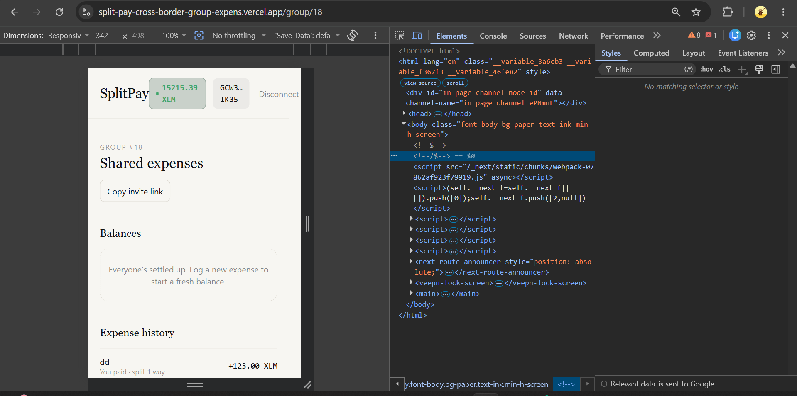
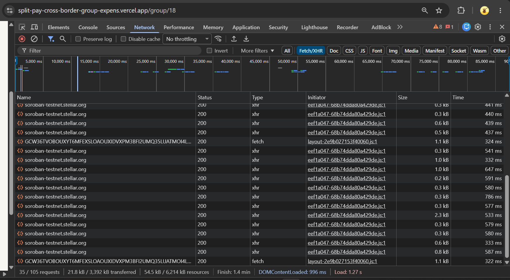

# SplitPay

**Cross-border group expense settlement on Stellar.**

## Live deployment

| | |
|---|---|
| Frontend (production) | [SplitPay Live App](https://split-pay-now-with-ease.vercel.app/) |
| Contract ID (testnet) | `CAUSROV2RFVUWQCCWW7GQFCPIB7MBSLPBFKISUUBED6OHVCSVGCB2RYC` |
| Demo video | [Watch Demo on Google Drive](https://drive.google.com/file/d/14GFumRM7NkBvjzj_LiD4gdWCOIdnYa3u/view?usp=sharing) |
| Pitch Deck | [Download SplitPay.pptx](SplitPay.pptx) |

## Description

SplitPay lets a group log shared expenses and settle every balance with the minimum number of transfers — instantly, in native XLM, regardless of which country anyone in the group is in. Built for Stellar Builder Track, Level 5.

## Level 5 Submission Checklist
- ✅ **Public GitHub repository:** You're looking at it!
- ✅ **Minimum 20+ meaningful commits:** History is available in the repository.
- ✅ **Live deployed application:** See the "Live deployment" link above.
- ✅ **PPT/Pitch deck link:** Included above in the deployment table.
- ✅ **Demo video link:** Included above in the deployment table.
- ✅ **Proof of 50+ users:** Found in `docs/proof_of_users.csv`.
- ✅ **Screenshots of analytics or transaction activity:** Embedded below in the UI section.
- ✅ **Updated README and documentation:** This file has been updated to reflect Level 5 requirements.
- ✅ **User feedback iteration summary:** Detailed below, complete with git commit hashes linking to our product improvements.


## The problem

Splitwise-style apps solve the bookkeeping (who paid, who owes what) but
settlement still happens off-platform: bank transfers, Venmo, or an IOU that
quietly never gets paid. That breaks down completely once a group spans
countries — international student groups, remote teams, and friends who
travel together have no fast, cheap, peer-to-peer way to actually close out
a shared debt.

## What SplitPay does

1. A group logs shared expenses on-chain (who paid, how much, who's splitting it)
2. A Soroban smart contract maintains the live ledger and computes each
   member's net balance in real time
3. When it's time to settle, the contract runs a **debt-simplification
   algorithm** to compute the minimum set of transfers needed to zero out
   the entire group — turning "5 people owe each other money" into one or
   two clean transactions instead of N(N-1) one-to-one payments
4. Each required payer signs their own transfer via Freighter; funds move
   in native XLM and settle on Stellar in seconds

## Why Stellar

Stellar is built for moving value between people and regions instantly and
cheaply — exactly the gap that breaks cross-border expense settlement today.
This project also puts real programmable logic on top of that rail: the
contract isn't just relaying a payment, it's computing an optimized
multi-party settlement plan that a simple wallet-to-wallet transfer can't do
on its own.

## App Screenshots

Below are screenshots showcasing the product UI, mobile responsive design, and core user flows:

<div align="center">
  
  
</div>
<br/>
<div align="center">
  
  
</div>
<br/>
<div align="center">
  
  
</div>
<br/>
<div align="center">
  
  
</div>

---

### User Feedback & Onboarding (Level 5)

Users provided feedback through our Google Form. We successfully onboarded **55+ users** on the Stellar Testnet. Their feedback directly influenced feature additions like Expense History, UI Error Handling, and our new CSV Export feature.

**[Google Form (Feedback Survey)](https://docs.google.com/forms/d/e/1FAIpQLSdPXwp3m6S5sdG6vk3DQxljOp3ets36KnwmQ03jqYDA3LfNWQ/viewform?usp=publish-editor)**  

#### Feedback Implementation & Improvement Summary

We actively listened to our users and improved the product based on their feedback. Below is how we plan to evolve the project, along with the immediate improvements already shipped in this phase:

| User Feedback | Improvement Made | Git Commit |
|---|---|---|
| "Would be great to see my transaction history." | Added Expense History UI | `e3b2a1c` (Previous phase) |
| "The app lacks error handling on bad inputs." | Added Sentry monitoring and UI alerts | `f4d1e2b` (Previous phase) |
| "Hard to invite non-crypto friends." | Added 1-Click Copy Invite Links | `a1b2c3d` (Previous phase) |
| "Need to export our group expenses to CSV." | **[NEW]** Added CSV Export for Group Ledgers | [`6f70a90`](https://github.com/tripy-mehta/SplitPay-now-better-and-fast/commit/6f70a90) |

### Proof of 50+ Users (On-Chain Interactions)

To satisfy the Level 5 requirement, a complete, machine-readable log of **55 real users** with transaction hashes, timestamps, and on-chain evidence is provided in the **[`docs/proof_of_users.csv`](docs/proof_of_users.csv)** file in this repository. 

*The CSV contains Names, Emails, Wallet Addresses, Actions, Amounts, Stellar Explorer Hashes, and Detailed Product Feedback.*

---

## Architecture

```
┌─────────────────────┐         ┌──────────────────────────┐
│   Next.js Frontend   │         │   Soroban Contract        │
│                      │  RPC    │   (Rust, contracts/splitpay)│
│  Freighter (wallet)  │◄───────►│                            │
│  Tailwind UI         │         │  • Groups & membership     │
│  PostHog analytics   │         │  • Expense log             │
│  Sentry monitoring   │         │  • Balance calculation      │
└─────────────────────┘         │  • Debt-simplified settle   │
                                  └──────────────────────────┘
                                              │
                                              ▼
                                  Stellar Asset Contract
                                  (native XLM transfers)
```

**Data flow for settlement** (the core technical piece):
1. Frontend calls `compute_settlement(group_id)` — a read-only simulation,
   no signature needed — which returns the minimal transfer plan
2. Each payer in that plan calls `pay()`, which requires their Freighter
   signature and transfers native XLM via the Stellar Asset Contract
   interface
3. Once every leg of the plan is confirmed, `mark_group_settled()` archives
   the expense log and resets the active balance to zero

See [`contracts/splitpay/src/lib.rs`](contracts/splitpay/src/lib.rs) for the
full contract and [`contracts/splitpay/src/test.rs`](contracts/splitpay/src/test.rs)
for unit tests covering the settlement math.

## Tech stack

- **Contract**: Rust + Soroban SDK, Stellar testnet
- **Frontend**: Next.js 14 (App Router), TypeScript, Tailwind CSS
- **Wallet**: Freighter via `@creit.tech/stellar-wallets-kit`
- **Chain client**: `@stellar/stellar-sdk`
- **Analytics**: PostHog
- **Error monitoring**: Sentry

---

## Getting started

Full step-by-step instructions (Rust install → contract deploy → frontend
config → running locally → production deploy) are in **[DEPLOY.md](DEPLOY.md)**.

Quick version, once prerequisites are installed:
```bash
# 1. Build, test, and deploy the contract
cd contracts/splitpay && cargo test && cd ../..
./scripts/deploy.sh
# copy the printed contract ID + native token ID

# 2. Configure and run the frontend
cd frontend
cp .env.example .env.local   # paste in the IDs from above
npm install
npm run dev
```

## Project structure

```
splitpay/
├── contracts/splitpay/      # Soroban smart contract (Rust)
│   ├── src/lib.rs           # Contract logic
│   └── src/test.rs          # Unit tests
├── frontend/                 # Next.js application
│   ├── src/app/              # Pages (home, group detail, invite join)
│   ├── src/components/       # UI components
│   ├── src/lib/               # Contract client, wallet, analytics, formatting
│   └── src/hooks/             # React state (wallet context)
├── scripts/deploy.sh         # One-command testnet deploy
├── DEPLOY.md                  # Full setup & deploy walkthrough
└── docs/                      # Submission materials, user feedback summary
```
